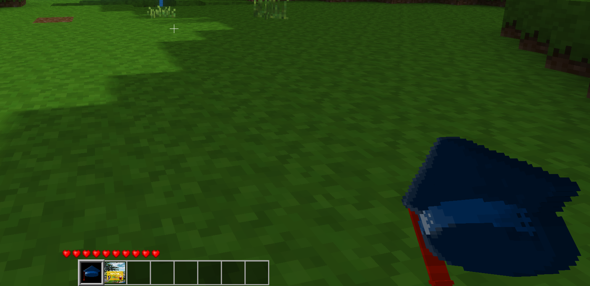

# Agentcards Mod

## Usage
### Add agent id badges
Put id badges named `agentcards_firstname_surname.png` for all the agents into the textures folder. Agentcards will find the textures and add them as blocks that cannot be found in the inventory.

### How to get agentcard-specific blocks
To get a specific **agent id badge**, type `/giveme agentcards:firstname_surname` into the textchat and press Enter.

To get the **agent handbook**, type `/giveme agentcards:handbook` into the textchat and press Enter.

To get the **SERASUM NFT**, type `/giveme agentcards:serasum_nft` into the textchat and press Enter.

The **graduation hat** can be found in the creative inventory or you can type `/giveme agentcards:graduation_cap` into the textchat and press Enter.
